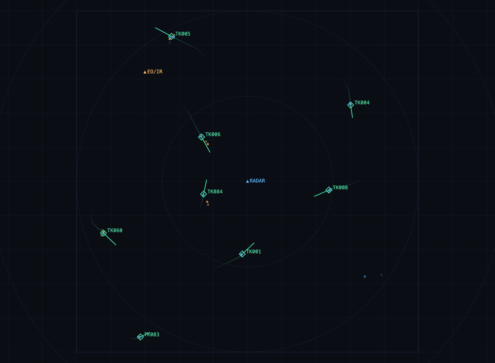

# skyfuse

A multi-sensor track fusion simulator I built to properly learn Kalman filtering and tracking. Three simulated sensors (radar, EO/IR, ADS-B) watch the same airspace and a fusion engine combines their noisy measurements into unified tracks, displayed on a live web dashboard.



## The idea

Each sensor is bad in a different way:

- **Radar** - decent range, mediocre bearing, false alarms (clutter), sometimes misses targets
- **EO/IR** - really accurate bearing but terrible range estimates, shorter reach
- **ADS-B** - super precise but only works on cooperative (transponder) aircraft

No single sensor gives the full picture, but fused together they cover each other's weaknesses. You can test this live: uncheck RADAR on the dashboard and watch the uncertainty ellipses grow and the RMSE go up. The one non-cooperative aircraft (invisible to ADS-B) eventually gets dropped. Turn radar back on and it recovers.

## How it works

Every sensor scan goes through the same steps:

1. Predict all tracks forward to the scan's timestamp (constant velocity model)
2. Gate: a detection only counts as a candidate for a track if its Mahalanobis distance is inside a chi-square gate
3. Assign detections to tracks with the Hungarian algorithm (scipy) - global assignment instead of greedy so it doesn't break when targets cross paths
4. Update matched tracks with an EKF. Radar/EO measurements are polar (range, bearing) so those go through a linearized update, ADS-B is cartesian so it's a normal linear update. Both update the same state, which is basically the whole fusion trick
5. Unmatched detections start new "tentative" tracks. 4 hits confirms a track, going silent for a while makes it coast and then get dropped. Radar clutter constantly creates tentative tracks but they die before confirming since random false alarms don't line up scan after scan

The tracker never sees the truth data - truth is only used by the metrics module to score the results (RMSE, missed targets, false tracks) shown on the dashboard.

A couple of bugs I hit that turned into tests:
- bearing innovation needs to be wrapped to [-pi, pi] or tracks blow up when a target crosses the +/-180 line behind the sensor
- the covariance update needs the Joseph form or P slowly stops being symmetric after enough updates

## Running

```bash
pip install -r requirements.txt
python run.py
# open http://localhost:8777
```

Tests:

```bash
python -m pytest tests/
```

## Stuff I want to add

- IMM (multiple motion models) - the single CV filter visibly lags when a target does a hard turn
- treat the EO sensor as bearing-only, which is how IRST actually works
- sensor bias estimation

Mostly learned from Bar-Shalom's *Estimation with Applications to Tracking and Navigation* + various lecture notes.

MIT license.
