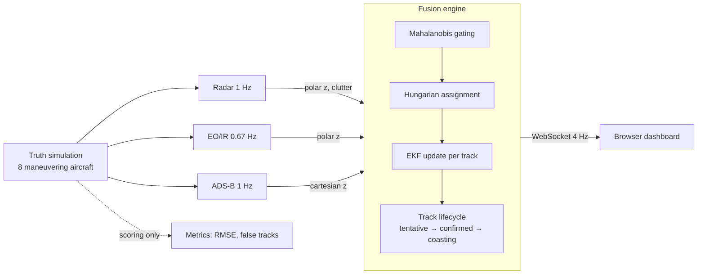

# SKYFUSE ✈︎

**A real-time multi-sensor track fusion engine.** Three simulated sensors with very different error characteristics watch the same airspace; SKYFUSE fuses their asynchronous, noisy, clutter-contaminated measurements into a single coherent set of tracks — and streams the live tactical picture to a browser dashboard.


The core problem here — *many unreliable data sources, one integrated view of the world* — is the heart of data fusion, whether the entities are aircraft, shipping containers, or database records.

## Why these three sensors

Fusion is only interesting when the sources genuinely disagree about what they're good at:

| Sensor | Measures | Strength | Weakness |
|---|---|---|---|
| **Radar** | range + bearing (polar) | good range accuracy, sees everyone | mediocre bearing, false alarms (clutter), missed detections |
| **EO/IR** | range + bearing (polar) | superb bearing (0.05°) | terrible range estimate (±1.5 km), shorter reach |
| **ADS-B** | position (cartesian) | very precise (±30 m) | **cooperative traffic only** — non-transponder targets are invisible to it |

No single sensor gives you the full picture. Fused, they cover each other's blind spots — and the dashboard lets you prove it: **toggle the radar off mid-run** and watch uncertainty ellipses balloon, the position RMSE triple, and the one non-cooperative target that only radar could see coast and drop. Toggle it back and watch the picture heal.

## Architecture



Each sensor scan — whenever it arrives, whatever it measures — flows through the same pipeline:

1. **Predict** every track forward to the scan timestamp (constant-velocity model with white-noise acceleration). This is what makes *asynchronous* fusion work: a track state is always propagated to measurement time before comparison.
2. **Gate** — a detection is a candidate for a track only if its squared Mahalanobis distance `νᵀS⁻¹ν` is inside a χ² 99% gate. The gate accounts for both track uncertainty and sensor noise, so a starving track opens up its gate while a well-fed one stays picky.
3. **Assign** — the Hungarian algorithm finds the globally optimal one-to-one track↔detection pairing. Greedy nearest-neighbor breaks when targets cross paths; global assignment doesn't.
4. **Update** — the Extended Kalman Filter fuses the measurement into the track state. Two measurement models share one state vector: cartesian (linear, ADS-B) and polar (nonlinear, linearized around the estimate — radar and EO/IR).
5. **Lifecycle** — unmatched detections seed *tentative* tracks; four consistent hits confirm; 2.5 silent seconds put a track into *coasting* (predict-only); 6 seconds drop it. Radar clutter constantly spawns tentative tracks that die before confirmation, because random false alarms don't line up scan after scan.


## Running it

```bash
pip install -r requirements.txt
python run.py            # then open http://localhost:8777
python run.py --seed 42  # reproducible scenario
```

Tests:

```bash
python -m pytest tests/ -v
```

The suite covers EKF convergence and consistency, the bearing-wrap edge case, gating behavior, the global-vs-greedy assignment case, track confirm/coast/drop lifecycle, and that scattered clutter never confirms into a false track.

## Things I'd build next

- **IMM (Interacting Multiple Model)** — run CV and coordinated-turn models in parallel and mix them; the single CV filter visibly lags during hard turns (watch a track during a maneuver).
- **Track-to-track fusion** — this engine fuses at the measurement level (centralized); a distributed variant would fuse per-sensor tracklets with covariance intersection.
- **Bearing-only EO** — treat EO/IR honestly as an angle-only sensor and let range become observable through geometry over time.
- **Sensor bias estimation** — augment the state to estimate and remove a miscalibrated sensor's systematic offset.

## Honesty notes

Everything here is textbook, public-domain estimation theory (Bar-Shalom et al., *Estimation with Applications to Tracking and Navigation*). The scenario, sensor characteristics, and code are entirely synthetic and my own.

MIT — see [LICENSE](LICENSE).
